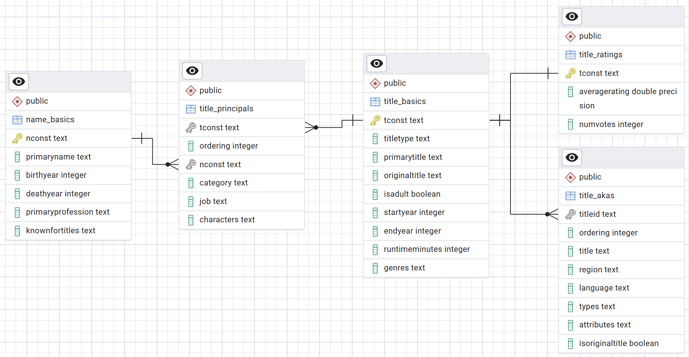

# SQL Practice with IMDb Dataset  

  
  
  
  
---

### Repository Contents  

- `imdb_schema.sql` → Database schema for IMDb dataset  
- `practice_queries.sql` → 7-day structured SQL revision queries  
- `imdb_erd.png` → Entity Relationship Diagram (ERD)  
- `imdb_dataset.zip` → Dataset files for hands-on practice  

---

### Skills Practiced  

- ✅ **Day 1–2:** SELECT, WHERE, ORDER BY, Aggregations (COUNT, SUM, AVG, GROUP BY)  
- ✅ **Day 3–4:** JOINs (INNER, LEFT), multi-table relationships  
- ✅ **Day 5–6:** Subqueries, CTEs, Window Functions  
- ✅ **Day 7:** Integrated analytics with advanced SQL techniques  

---

### ERD  

  

---

### Blog Walkthrough  
Full 7-day SQL revision journey is documented here:  
[How I Mastered SQL in 7 Days: A Data Engineer’s Journey](https://medium.com/@ghazal3501/how-i-mastered-sql-in-7-days-a-data-engineers-journey-2153382d025e)  

---

### What You’ll Learn  

- How to practice SQL using a **realistic multi-table dataset**  
- How to structure a **7-day revision roadmap** for maximum impact  
- How to apply SQL concepts in **business-driven scenarios** (analytics, market trends, performance insights)  
- How to optimize queries with **indexes & execution planning**  

---

### Contact  

 [ghazal3501@gmail.com](mailto:ghazal3501@gmail.com)  
 [LinkedIn](https://linkedin.com/in/ghazaleashar)  

---

>  *From SELECT to advanced analytics — SQL mastery in one structured roadmap.*  
